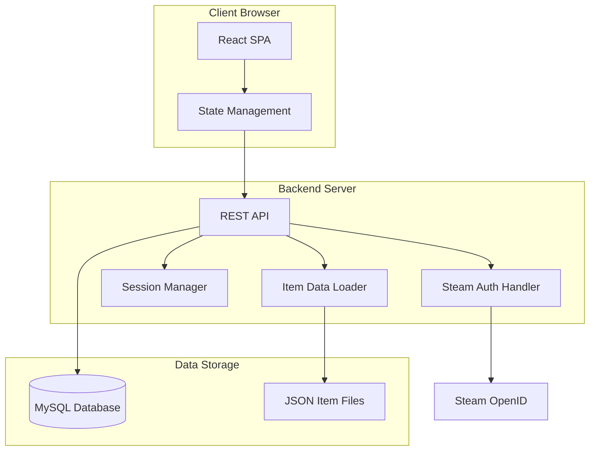
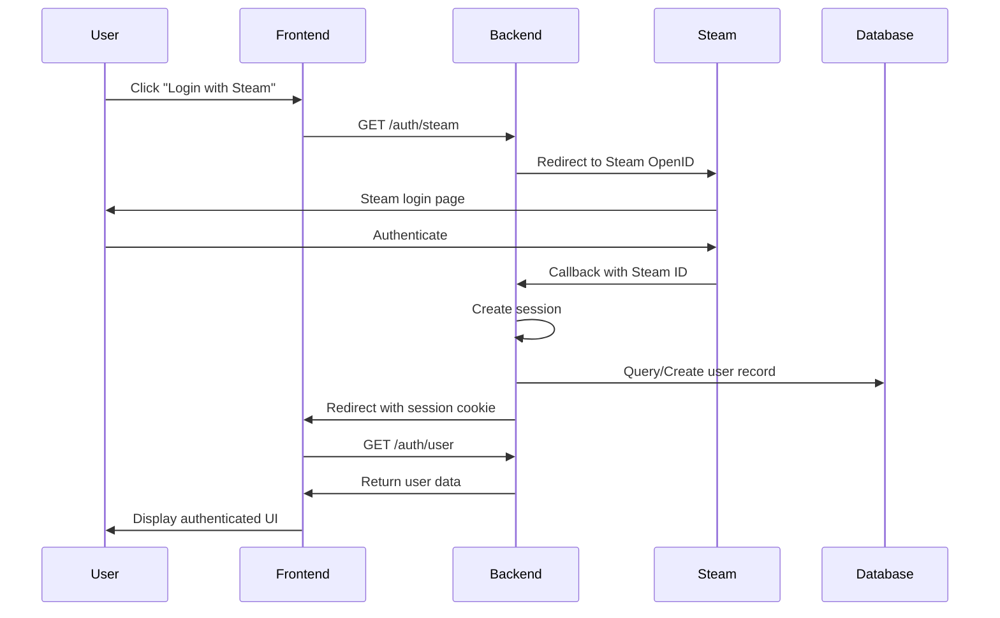

# Design Document: CS2 WeaponPaints Web Interface

## Overview

The CS2 WeaponPaints Web Interface is a full-stack web application that provides a modern, responsive interface for Counter-Strike 2 players to customize their in-game cosmetic items. The system consists of a backend API server that interfaces with the existing MySQL database and serves item data, and a frontend single-page application (SPA) that provides an intuitive user experience for managing weapon skins, knives, gloves, agents, music kits, and pins.

The architecture follows a three-tier pattern:
1. **Presentation Layer**: React-based SPA with responsive UI components
2. **Application Layer**: RESTful API server handling business logic and authentication
3. **Data Layer**: MySQL database (existing schema) and JSON item data files

## Architecture

### System Architecture



### Technology Stack

**Frontend:**
- React 18+ with TypeScript for type safety
- React Router for client-side routing
- Axios for HTTP requests
- TanStack Query (React Query) for server state management
- Tailwind CSS for responsive styling
- Zustand or Context API for client state management

**Backend:**
- Node.js with Express.js (or alternative: Python with FastAPI)
- Passport.js with passport-steam for Steam OpenID authentication
- express-session for session management
- mysql2 for database connectivity
- Joi or Zod for input validation

**Database:**
- MySQL (existing schema, no modifications required)

### Authentication Flow



## Components and Interfaces

### Frontend Components

#### 1. Authentication Components

**LoginPage**
- Displays Steam login button
- Handles authentication redirects
- Shows loading state during authentication

**AuthGuard**
- Protects authenticated routes
- Redirects unauthenticated users to login
- Validates session on mount

#### 2. Layout Components

**AppLayout**
- Top navigation bar with user profile and logout
- Sidebar navigation for different customization categories
- Main content area
- Responsive breakpoints for mobile/tablet/desktop

**NavigationSidebar**
- Links to: Weapons, Knives, Gloves, Agents, Music Kits, Pins
- Active route highlighting
- Collapsible on mobile

#### 3. Customization Components

**WeaponCustomizer**
- Weapon category tabs (Rifles, Pistols, SMGs, etc.)
- Weapon selection grid
- Skin selection modal with search/filter
- Configuration panel for wear, seed, nametag, StatTrak
- Sticker application interface (up to 5 stickers)
- Keychain application interface
- Save/Reset buttons

**KnifeCustomizer**
- Team selector tabs (T/CT)
- Knife model selection grid
- Skin selection with preview
- Wear and seed configuration
- Save button per team

**GloveCustomizer**
- Team selector tabs (T/CT)
- Glove model selection grid with previews
- Save button per team

**AgentCustomizer**
- Team selector tabs (T/CT)
- Agent model selection grid with images
- Save button per team

**MusicKitCustomizer**
- Team selector tabs (T/CT)
- Music kit selection list with audio preview
- Save button per team

**PinCustomizer**
- Team selector tabs (T/CT)
- Pin selection grid with images
- Save button per team

#### 4. Shared Components

**ItemGrid**
- Reusable grid component for displaying items
- Search input
- Filter dropdowns (rarity, collection, type)
- Pagination or infinite scroll
- Item cards with image, name, and selection state

**ItemPreview**
- Large preview image of selected item
- Wear slider with live preview update
- Seed input with preview update
- Item details (name, rarity, collection)

**StickerConfigurator**
- List of applied stickers (max 5)
- Add sticker button
- Per-sticker configuration: position (x, y), wear, scale, rotation
- Remove sticker button
- Visual preview on weapon (if feasible)

**KeychainConfigurator**
- Keychain selection
- Position configuration (x, y, z)
- Seed input
- Visual preview (if feasible)

**TeamTabs**
- Tab component for T/CT team switching
- Displays team-specific data
- Visual indicator for active team

### Backend API Endpoints

#### Authentication Endpoints

```
GET  /api/auth/steam          - Initiate Steam OpenID authentication
GET  /api/auth/steam/callback - Handle Steam authentication callback
GET  /api/auth/user           - Get current authenticated user
POST /api/auth/logout         - Logout and destroy session
```

#### Item Data Endpoints

```
GET /api/items/skins          - Get all weapon skins from skins_en.json
GET /api/items/gloves         - Get all gloves from gloves_en.json
GET /api/items/agents         - Get all agents from agents_en.json
GET /api/items/music          - Get all music kits from music_en.json
GET /api/items/pins           - Get all pins from collectibles_en.json
```

#### Player Configuration Endpoints

```
GET    /api/player/weapons              - Get all weapon configurations
PUT    /api/player/weapons/:weaponId    - Update weapon configuration
DELETE /api/player/weapons/:weaponId    - Reset weapon configuration

GET    /api/player/knife/:team          - Get knife configuration for team (2 or 3)
PUT    /api/player/knife/:team          - Update knife configuration for team
DELETE /api/player/knife/:team          - Reset knife configuration for team

GET    /api/player/gloves/:team         - Get gloves configuration for team
PUT    /api/player/gloves/:team         - Update gloves configuration for team
DELETE /api/player/gloves/:team         - Reset gloves configuration for team

GET    /api/player/agents/:team         - Get agent configuration for team
PUT    /api/player/agents/:team         - Update agent configuration for team
DELETE /api/player/agents/:team         - Reset agent configuration for team

GET    /api/player/music/:team          - Get music kit configuration for team
PUT    /api/player/music/:team          - Update music kit configuration for team
DELETE /api/player/music/:team          - Reset music kit configuration for team

GET    /api/player/pins/:team           - Get pin configuration for team
PUT    /api/player/pins/:team           - Update pin configuration for team
DELETE /api/player/pins/:team           - Reset pin configuration for team
```

#### Bulk Operations Endpoints

```
POST /api/player/copy-team              - Copy configuration from one team to another
                                          Body: { from: 2|3, to: 2|3, categories: string[] }
POST /api/player/reset                  - Reset all or specific configurations
                                          Body: { categories: string[] }
```

### API Request/Response Formats

#### Weapon Configuration

**Request (PUT /api/player/weapons/:weaponId):**
```json
{
  "paintId": 123,
  "wear": 0.15,
  "seed": 500,
  "nametag": "My Weapon",
  "stattrak": true,
  "stattrakCounter": 1337,
  "stickers": [
    {
      "id": 1,
      "schema": 0,
      "x": 0.5,
      "y": 0.5,
      "wear": 0.0,
      "scale": 1.0,
      "rotation": 0.0
    }
  ],
  "keychain": {
    "id": 10,
    "x": 0.0,
    "y": 0.0,
    "z": 0.0,
    "seed": 100
  }
}
```

**Response:**
```json
{
  "success": true,
  "data": {
    "weaponId": "weapon_ak47",
    "paintId": 123,
    "wear": 0.15,
    "seed": 500,
    "nametag": "My Weapon",
    "stattrak": true,
    "stattrakCounter": 1337,
    "stickers": "1;0;0.5;0.5;0.0;1.0;0.0",
    "keychains": "10;0.0;0.0;0.0;100"
  }
}
```

#### Team-Specific Configuration

**Request (PUT /api/player/knife/2):**
```json
{
  "knifeId": "weapon_knife_butterfly",
  "paintId": 456,
  "wear": 0.05,
  "seed": 250
}
```

**Response:**
```json
{
  "success": true,
  "data": {
    "team": 2,
    "knifeId": "weapon_knife_butterfly",
    "paintId": 456,
    "wear": 0.05,
    "seed": 250
  }
}
```

## Data Models

### Database Schema (Existing)

**wp_player_skins**
```sql
CREATE TABLE wp_player_skins (
  steamid VARCHAR(64) NOT NULL,
  weapon_defindex INT NOT NULL,
  weapon_paint_id INT,
  weapon_wear FLOAT,
  weapon_seed INT,
  weapon_nametag VARCHAR(255),
  weapon_stattrak BOOLEAN,
  weapon_stattrak_count INT,
  weapon_stickers TEXT,
  weapon_keychains TEXT,
  PRIMARY KEY (steamid, weapon_defindex)
);
```

**wp_player_knife**
```sql
CREATE TABLE wp_player_knife (
  steamid VARCHAR(64) NOT NULL,
  team INT NOT NULL,
  knife_defindex INT,
  knife_paint_id INT,
  knife_wear FLOAT,
  knife_seed INT,
  PRIMARY KEY (steamid, team)
);
```

**wp_player_gloves**
```sql
CREATE TABLE wp_player_gloves (
  steamid VARCHAR(64) NOT NULL,
  team INT NOT NULL,
  glove_defindex INT,
  PRIMARY KEY (steamid, team)
);
```

**wp_player_agents**
```sql
CREATE TABLE wp_player_agents (
  steamid VARCHAR(64) NOT NULL,
  team INT NOT NULL,
  agent_ct VARCHAR(255),
  agent_t VARCHAR(255),
  PRIMARY KEY (steamid, team)
);
```

**wp_player_music**
```sql
CREATE TABLE wp_player_music (
  steamid VARCHAR(64) NOT NULL,
  team INT NOT NULL,
  music_id INT,
  PRIMARY KEY (steamid, team)
);
```

**wp_player_pins**
```sql
CREATE TABLE wp_player_pins (
  steamid VARCHAR(64) NOT NULL,
  team INT NOT NULL,
  pin_id INT,
  PRIMARY KEY (steamid, team)
);
```

### Frontend Data Models (TypeScript)

```typescript
// User session
interface User {
  steamId: string;
  displayName: string;
  avatarUrl: string;
}

// Item data structures
interface WeaponSkin {
  id: number;
  paintId: number;
  name: string;
  imageUrl: string;
  rarity: string;
  collection: string;
  weaponType: string;
}

interface Glove {
  id: number;
  defindex: number;
  name: string;
  imageUrl: string;
}

interface Agent {
  id: string;
  name: string;
  imageUrl: string;
  team: 'T' | 'CT' | 'Both';
}

interface MusicKit {
  id: number;
  name: string;
  artist: string;
  previewUrl?: string;
}

interface Pin {
  id: number;
  name: string;
  imageUrl: string;
  series: string;
}

// Configuration structures
interface Sticker {
  id: number;
  schema: number;
  x: number;
  y: number;
  wear: number;
  scale: number;
  rotation: number;
}

interface Keychain {
  id: number;
  x: number;
  y: number;
  z: number;
  seed: number;
}

interface WeaponConfig {
  weaponDefindex: number;
  paintId?: number;
  wear: number;
  seed: number;
  nametag?: string;
  stattrak: boolean;
  stattrakCounter: number;
  stickers: Sticker[];
  keychain?: Keychain;
}

interface KnifeConfig {
  team: 2 | 3;
  knifeDefindex?: number;
  paintId?: number;
  wear: number;
  seed: number;
}

interface GloveConfig {
  team: 2 | 3;
  gloveDefindex?: number;
}

interface AgentConfig {
  team: 2 | 3;
  agentId?: string;
}

interface MusicConfig {
  team: 2 | 3;
  musicId?: number;
}

interface PinConfig {
  team: 2 | 3;
  pinId?: number;
}
```

### Data Transformation Layer

The backend must transform between database formats and API formats:

**Sticker Serialization:**
```
Database format: "1;0;0.5;0.5;0.0;1.0;0.0,2;0;0.3;0.3;0.0;1.0;0.0"
API format: Array of Sticker objects
```

**Keychain Serialization:**
```
Database format: "10;0.0;0.0;0.0;100"
API format: Keychain object
```

**Transformation Functions:**
```typescript
function serializeStickers(stickers: Sticker[]): string {
  return stickers
    .map(s => `${s.id};${s.schema};${s.x};${s.y};${s.wear};${s.scale};${s.rotation}`)
    .join(',');
}

function deserializeStickers(stickerString: string): Sticker[] {
  if (!stickerString) return [];
  return stickerString.split(',').map(s => {
    const [id, schema, x, y, wear, scale, rotation] = s.split(';').map(Number);
    return { id, schema, x, y, wear, scale, rotation };
  });
}

function serializeKeychain(keychain: Keychain): string {
  return `${keychain.id};${keychain.x};${keychain.y};${keychain.z};${keychain.seed}`;
}

function deserializeKeychain(keychainString: string): Keychain | null {
  if (!keychainString) return null;
  const [id, x, y, z, seed] = keychainString.split(';').map(Number);
  return { id, x, y, z, seed };
}
```


## Correctness Properties

*A property is a characteristic or behavior that should hold true across all valid executions of a system—essentially, a formal statement about what the system should do. Properties serve as the bridge between human-readable specifications and machine-verifiable correctness guarantees.*

### Property 1: Steam ID String Format

*For any* successful Steam authentication, the extracted Steam_ID should be stored and handled as a 64-bit string format (e.g., "76561198001234567"), never as a numeric type.

**Validates: Requirements 1.3, 13.2**

### Property 2: Session Creation on Authentication

*For any* authenticated user, the system should create or retrieve a valid session that persists across requests until logout or expiration.

**Validates: Requirements 1.4**

### Property 3: Session Termination on Logout

*For any* active session, performing a logout operation should terminate the session and clear all authentication data, making subsequent authenticated requests fail.

**Validates: Requirements 1.6**

### Property 4: Weapon Skin Data Loading

*For any* weapon selection, the system should load available skins from skins_en.json containing Paint_ID, name, and image URL for that weapon type.

**Validates: Requirements 2.2**

### Property 5: Weapon Configuration Persistence

*For any* weapon skin configuration (paint_id, wear, seed, nametag, stattrak), saving the configuration should persist all fields to wp_player_skins table, and loading should retrieve the same values.

**Validates: Requirements 2.3, 2.6, 2.7**

### Property 6: Wear Value Validation

*For any* wear value input, the system should accept values between 0.00 and 1.00 inclusive, and reject all values outside this range with a validation error.

**Validates: Requirements 2.4**

### Property 7: Seed Value Validation

*For any* seed value input, the system should accept integer values between 0 and 1000 inclusive, and reject all values outside this range with a validation error.

**Validates: Requirements 2.5**

### Property 8: Team-Specific Data Isolation

*For any* team-specific item configuration (knife, gloves, agents, music, pins), saving data for Team_Value 2 (Terrorist) should not affect data for Team_Value 3 (Counter-Terrorist), and vice versa. Each team should maintain completely independent configurations.

**Validates: Requirements 3.2, 3.5, 4.3, 5.3, 5.4, 6.3, 7.3, 12.1, 12.3, 13.4**

### Property 9: Team Configuration Loading

*For any* team-specific item type, switching between Team_Value 2 and Team_Value 3 should load and display the correct team-specific configuration without cross-contamination.

**Validates: Requirements 3.4, 12.2**

### Property 10: Knife Configuration with Wear and Seed

*For any* knife selection, the system should support wear and seed configuration with the same validation rules as weapon skins (wear: 0.00-1.00, seed: 0-1000).

**Validates: Requirements 3.3**

### Property 11: Glove Configuration Round-Trip

*For any* glove selection and team, saving the glove configuration should persist it to wp_player_gloves with the correct Team_Value, and loading should retrieve the same glove selection for that team.

**Validates: Requirements 4.4**

### Property 12: Agent Configuration Round-Trip

*For any* agent selection and team, saving the agent configuration should persist it to wp_player_agents with the correct Team_Value, and loading should retrieve the same agent selection for that team.

**Validates: Requirements 5.5**

### Property 13: Music Kit Configuration Round-Trip

*For any* music kit selection and team, saving the music kit configuration should persist it to wp_player_music with the correct Team_Value, and loading should retrieve the same music kit selection for that team.

**Validates: Requirements 6.4**

### Property 14: Pin Configuration Round-Trip

*For any* pin selection and team, saving the pin configuration should persist it to wp_player_pins with the correct Team_Value, and loading should retrieve the same pin selection for that team.

**Validates: Requirements 7.4**

### Property 15: StatTrak Configuration Persistence

*For any* weapon with StatTrak enabled, saving should persist both the StatTrak flag and counter value to wp_player_skins, and loading should retrieve both values correctly.

**Validates: Requirements 8.2, 8.5**

### Property 16: StatTrak Counter Validation

*For any* StatTrak counter input, the system should accept non-negative integer values and reject negative values or non-integer inputs with a validation error.

**Validates: Requirements 8.4**

### Property 17: Nametag Validation and Persistence

*For any* nametag input, the system should validate text length and allowed characters, persist valid nametags to wp_player_skins, and reject invalid nametags with descriptive errors.

**Validates: Requirements 9.2, 9.3**

### Property 18: Nametag Round-Trip

*For any* valid nametag saved to a weapon, loading the weapon configuration should retrieve the exact same nametag text.

**Validates: Requirements 9.4**

### Property 19: Sticker Serialization Round-Trip

*For any* array of sticker configurations (up to 5 stickers with id, schema, x, y, wear, scale, rotation), serializing to the delimited string format then deserializing should produce an equivalent array of sticker objects with the same values.

**Validates: Requirements 10.3, 10.4, 10.5, 10.6, 13.6**

### Property 20: Keychain Serialization Round-Trip

*For any* keychain configuration (id, x, y, z, seed), serializing to the delimited string format "id;x;y;z;seed" then deserializing should produce an equivalent keychain object with the same values.

**Validates: Requirements 11.3, 11.4, 11.5, 13.6**

### Property 21: Complete Weapon Configuration Persistence

*For any* complete weapon configuration including paint_id, wear, seed, nametag, stattrak, stickers, and keychains, saving should persist all fields to wp_player_skins, and loading should retrieve all fields with their original values.

**Validates: Requirements 13.3**

### Property 22: Item Identifier Correctness

*For any* item selection (skin, glove, agent, music kit, pin), the system should use the correct identifier (Paint_ID or equivalent) from the corresponding Item_Data_File when saving to the database.

**Validates: Requirements 14.3**

### Property 23: Search Functionality

*For any* search query string, the system should return only items whose names contain the search query (case-insensitive), and all returned items should match the query.

**Validates: Requirements 17.2**

### Property 24: Filter Functionality

*For any* filter criteria (rarity, collection, type), the system should return only items that match all applied filter criteria, and all returned items should satisfy the filters.

**Validates: Requirements 17.3**

### Property 25: Filter Clear Restoration

*For any* item list with active filters, clearing all filters should restore the complete unfiltered item list with the same count as the original full list.

**Validates: Requirements 17.4**

### Property 26: Team Configuration Copy

*For any* source team configuration (Team_Value 2 or 3), copying to the target team should create new database entries with the target Team_Value that contain equivalent configuration data to the source team.

**Validates: Requirements 12.5, 18.1, 18.2**

### Property 27: Configuration Reset

*For any* player configuration (weapon, knife, glove, agent, music, pin), performing a reset operation should delete the specified entries from the database, and subsequent loads should return empty or default values.

**Validates: Requirements 18.4**

### Property 28: Input Validation Rejection

*For any* invalid input data (out-of-range values, incorrect formats, invalid characters), the system should reject the request, not persist the data, and return a descriptive error message.

**Validates: Requirements 19.3, 19.4**

### Property 29: Authorization Enforcement

*For any* data access or modification request, the system should verify that the session Steam_ID matches the requested data's Steam_ID, and reject requests where they don't match.

**Validates: Requirements 13.5, 19.6**

### Property 30: Error Logging Completeness

*For any* error that occurs during database operations, authentication, or file loading, the system should log the error with timestamp, user context (Steam_ID if available), and error details.

**Validates: Requirements 20.1, 20.4**

### Property 31: Error Message Sanitization

*For any* error displayed to users, the error message should be user-friendly and should not expose sensitive system information such as database connection strings, file paths, or stack traces.

**Validates: Requirements 20.2**

## Error Handling

### Authentication Errors

**Steam OpenID Failures:**
- Network errors during Steam communication → Display "Unable to connect to Steam. Please try again."
- Invalid Steam response → Display "Authentication failed. Please try again."
- Session creation failures → Log error, display "Unable to create session. Please contact support."

**Session Errors:**
- Expired session → Redirect to login with message "Your session has expired. Please log in again."
- Invalid session token → Clear session, redirect to login
- Session Steam_ID mismatch → Return 403 Forbidden, log security event

### Database Errors

**Connection Errors:**
- Database unavailable → Display "Service temporarily unavailable. Please try again later."
- Connection timeout → Retry with exponential backoff (3 attempts), then display error
- Connection pool exhausted → Queue request or return 503 Service Unavailable

**Query Errors:**
- Constraint violations → Display "Invalid data. Please check your input."
- Duplicate key errors → Display "Configuration already exists."
- Foreign key violations → Display "Invalid reference. Please refresh and try again."
- Deadlocks → Retry transaction (3 attempts), then display error

### Validation Errors

**Input Validation:**
- Out-of-range wear value → "Wear value must be between 0.00 and 1.00"
- Out-of-range seed value → "Seed value must be between 0 and 1000"
- Invalid nametag → "Nametag contains invalid characters or exceeds length limit"
- Invalid StatTrak counter → "StatTrak counter must be a non-negative integer"
- Too many stickers → "Maximum 5 stickers allowed per weapon"

**Data Format Errors:**
- Invalid sticker string format → Log error, display "Invalid sticker configuration"
- Invalid keychain string format → Log error, display "Invalid keychain configuration"
- Malformed JSON in item files → Log error, use cached data or display "Item data unavailable"

### File Loading Errors

**Item Data File Errors:**
- File not found → Log error, display "Item data not available. Please contact support."
- JSON parse error → Log error with file name and line number, use cached data if available
- Missing required fields → Log warning, skip invalid items, load valid items
- Network errors (if loading from CDN) → Retry with exponential backoff, fall back to cached data

### API Errors

**Client Errors (4xx):**
- 400 Bad Request → Return validation errors in response body
- 401 Unauthorized → Return "Authentication required"
- 403 Forbidden → Return "Access denied"
- 404 Not Found → Return "Resource not found"
- 429 Too Many Requests → Return "Rate limit exceeded. Please try again later."

**Server Errors (5xx):**
- 500 Internal Server Error → Log full error details, return generic message to client
- 503 Service Unavailable → Return "Service temporarily unavailable"
- 504 Gateway Timeout → Return "Request timeout. Please try again."

### Error Recovery Strategies

**Graceful Degradation:**
- If item images fail to load → Display placeholder images
- If preview generation fails → Display static preview or hide preview
- If search/filter fails → Display full unfiltered list
- If one item category fails to load → Allow access to other categories

**Retry Logic:**
- Transient database errors → Retry with exponential backoff (100ms, 200ms, 400ms)
- Network errors → Retry with exponential backoff (1s, 2s, 4s)
- File loading errors → Retry once immediately, then use cache

**Fallback Mechanisms:**
- Item data files → Use in-memory cache from previous successful load
- Database connection → Connection pool with automatic reconnection
- Session storage → Fall back to stateless JWT tokens if session store fails

## Testing Strategy

### Dual Testing Approach

The testing strategy employs both unit tests and property-based tests to ensure comprehensive coverage:

**Unit Tests** focus on:
- Specific examples of correct behavior
- Edge cases (empty configurations, maximum sticker count, boundary values)
- Error conditions (invalid inputs, missing data, database failures)
- Integration points (API endpoints, database queries, authentication flow)
- UI component rendering and interactions

**Property-Based Tests** focus on:
- Universal properties that hold for all inputs
- Round-trip consistency (serialization/deserialization)
- Data isolation between teams
- Input validation across all possible values
- Authorization enforcement across all access patterns

Both approaches are complementary and necessary. Unit tests catch specific bugs and validate concrete scenarios, while property-based tests verify general correctness across a wide range of inputs through randomization.

### Property-Based Testing Configuration

**Testing Library Selection:**
- **Frontend (TypeScript/JavaScript)**: fast-check
- **Backend (Node.js/TypeScript)**: fast-check
- **Backend (Python alternative)**: Hypothesis

**Test Configuration:**
- Minimum 100 iterations per property test (due to randomization)
- Each property test must include a comment tag referencing the design document property
- Tag format: `// Feature: cs2-weaponpaints-web-interface, Property N: [property title]`

**Example Property Test Structure:**

```typescript
// Feature: cs2-weaponpaints-web-interface, Property 19: Sticker Serialization Round-Trip
test('sticker serialization round-trip', () => {
  fc.assert(
    fc.property(
      fc.array(stickerArbitrary(), { maxLength: 5 }),
      (stickers) => {
        const serialized = serializeStickers(stickers);
        const deserialized = deserializeStickers(serialized);
        expect(deserialized).toEqual(stickers);
      }
    ),
    { numRuns: 100 }
  );
});
```

### Unit Testing Strategy

**Backend Unit Tests:**
- API endpoint handlers (request/response validation)
- Authentication middleware (session validation, Steam OpenID flow)
- Data transformation functions (serialization/deserialization)
- Database query builders
- Input validation functions
- Error handling middleware

**Frontend Unit Tests:**
- Component rendering (React Testing Library)
- User interactions (button clicks, form submissions)
- State management (Zustand/Context)
- API client functions (mocked responses)
- Form validation
- Error boundary components

**Integration Tests:**
- Full authentication flow (Steam OpenID → session creation → data access)
- End-to-end API workflows (login → load data → modify → save → verify)
- Database transactions (save → load → verify)
- File loading and caching

### Test Data Management

**Fixtures:**
- Sample item data files (skins_en.json, gloves_en.json, etc.)
- Sample player configurations for all item types
- Sample Steam authentication responses
- Sample database records

**Generators (for property-based tests):**
- Random Steam IDs (64-bit strings)
- Random weapon configurations (valid paint IDs, wear, seed, nametags)
- Random sticker arrays (0-5 stickers with valid parameters)
- Random keychain configurations
- Random team values (2 or 3)
- Random item selections from data files

**Database Test Strategy:**
- Use in-memory SQLite for unit tests (schema compatible with MySQL)
- Use Docker MySQL container for integration tests
- Reset database state between tests
- Use transactions for test isolation

### Coverage Goals

- **Line Coverage**: Minimum 80% for backend, 70% for frontend
- **Branch Coverage**: Minimum 75% for backend, 65% for frontend
- **Property Test Coverage**: All 31 correctness properties must have corresponding property-based tests
- **Critical Path Coverage**: 100% coverage for authentication, authorization, and data persistence paths

### Continuous Integration

- Run all tests on every pull request
- Run property-based tests with increased iterations (1000) on main branch
- Run integration tests against real MySQL database in CI
- Fail build on any test failure or coverage decrease
- Generate and publish coverage reports
